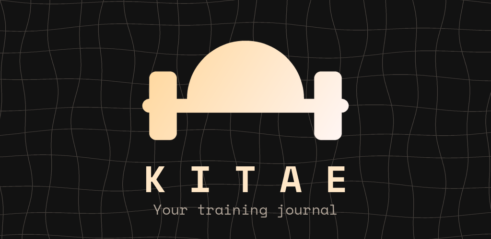
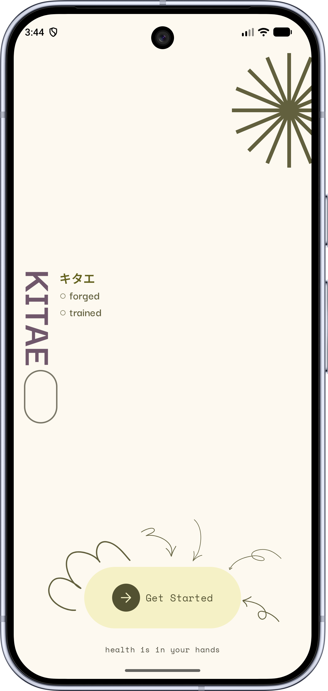
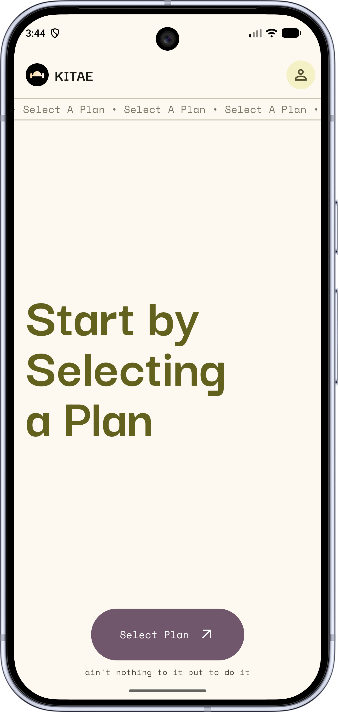
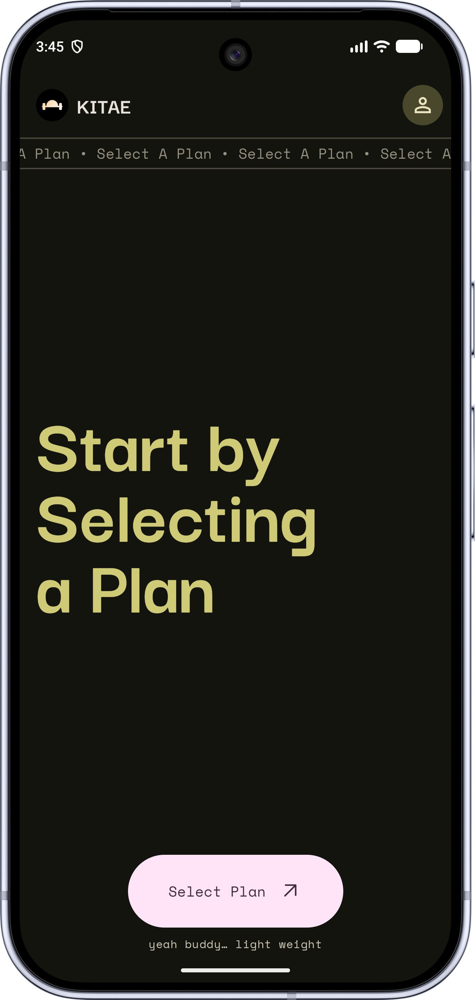
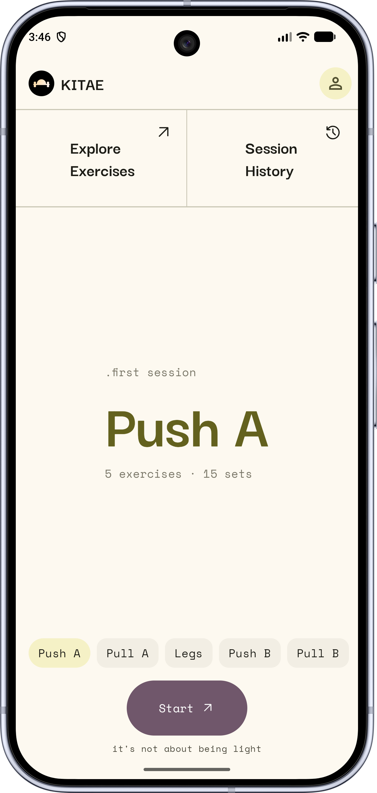

> [!Warning]
> **Free and Open-Source Android is under threat.**
>
> From 2027*, Google’s proposed changes could make it impossible to install Android apps from developers who have not registered with Google, signed its contract, paid up, and submitted government ID.
>
> Don’t let Android become a locked-down platform. Protect your freedom to install the apps you choose.
>
> [**Keep Android Open**](https://keepandroidopen.org/)
>
> \*The proposed changes and timeline are subject to change.

<div align="center">



Kitae is a workout journal built around your training days: plan your split once, then pick a day and tick off your sets.

**[Download the latest APK](https://codeberg.org/gureetk/kitae/releases/latest)**

</div>

<p align="center">
  
  
  
  
</p>

## Download

APKs for every version are on the [releases page](https://codeberg.org/gureetk/kitae/releases). Kitae runs on Android 8.0 or newer.

Kitae is developed on [Codeberg](https://codeberg.org/gureetk/kitae). Its GitHub repository is a read-only mirror, without releases or issues.

## Features

- **Named training days**: build plans from days like Push, Pull, Legs or Upper, and start whichever you're up for
- **Sets planned ahead**: every exercise comes with its sets ready when you start a workout
- **Tick off your sets**: unfinished ones can be kept as skipped or removed from the plan when you finish
- **Plans that keep up with you**: the reps and weights you use are saved back to the plan, and sets you add can join it
- **Rest timer**: starts when you finish a set, keeps counting with the screen off, and can be shortened, extended or skipped from its notification. Exercises and single sets can have their own rest time
- **Exercise pages**: how to do each exercise, and your progress on it from one workout to the next
- **Set types**: warm-up, standard, failure, drop and rest-pause sets, numbered W1, F1, D1 and R1
- **History and stats**: every workout is saved with how long it took, and the You tab counts your lifts and the days you've trained
- **Kilograms or pounds**
- **Private**: no internet access at all. Your data stays on your phone, and backups go to a folder you pick

## Building

Open the project in Android Studio, or build from a terminal with the Android SDK and Java 17 or newer:

```
./gradlew assembleDebug
```

Release builds are signed when a `keystore.properties` file is present (see `keystore.example.properties`), and unsigned otherwise.

## Bugs and ideas

Open an [issue](https://codeberg.org/gureetk/kitae/issues).

## The name

鍛え (*kitae*) comes from the Japanese *kitaeru*, "to forge, to train": what lifting does to you, one session at a time.

## Changelog

See [CHANGELOG.md](CHANGELOG.md).

## Credits

Kitae is a fork of [Kenko](https://codeberg.org/Iamlooker/Kenko) by LooKeR. Thanks to LooKeR and Kenko's contributors, whose work it builds on.

Most of the code Kitae adds to Kenko was written with Claude, an AI assistant, and tested on a phone before each release.

## License

```
Kitae
Copyright (C) 2026 Kitae Contributors

Based on Kenko
Copyright (C) 2025 LooKeR & Contributors

This program is free software: you can redistribute it and/or modify
it under the terms of the GNU General Public License as published by
the Free Software Foundation, either version 3 of the License, or
(at your option) any later version.
This program is distributed in the hope that it will be useful,
but WITHOUT ANY WARRANTY; without even the implied warranty of
MERCHANTABILITY or FITNESS FOR A PARTICULAR PURPOSE.  See the
GNU General Public License for more details.
You should have received a copy of the GNU General Public License
along with this program.  If not, see <http://www.gnu.org/licenses/>.
```
